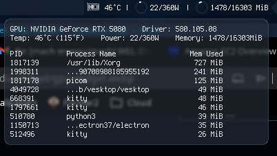

# Nvidia Widget

This widget shows you some stats like your total VRAM usage, power utilization, GPU temperature, as well as the top processes that are utilizing your VRAM. Clicking on the widget will show more details.

### What the Widget Shows



##### Main Widget Display:
- GPU temperature (°C)
- Power usage (current/max watts)
- VRAM usage (used/total MiB) with visual arc indicator

##### Popup Details (click to open):
- GPU name and driver version
- Temperature (Celsius and Fahrenheit)
- Power consumption
- Memory usage
- Top 10 processes using VRAM (PID, process name, memory used)


### Dependencies

You should probably already have these installed but incase you don't, this project depends on `nvidia-smi`, as well as some standard Unix tools like `awk`, `sort`, and `head` to work.

### Example Usage

```
local nvidia_widget = require("awesome-wm-widgets.nvidia-widget.nvidia-widget")

s.mywibox:setup({
    layout = wibox.layout.align.horizontal,
    { 
        layout = wibox.layout.fixed.horizontal,
        wibox.container.background(nvidia_widget({ popup_bg = "#2E3440A0" }), "#27374DA0")
    }
})

```

### Parameters

| Name | Default | Description |
|------|---------|-------------|
| `refresh_rate` | `1` | Refresh interval in seconds for updating GPU statistics |
| `popup_bg` | `"#2E3440"` | Background color of the popup window (hex color string) |
| `popup_border_color` | `"#4C566A"` | Border color of the popup window (hex color string) |
